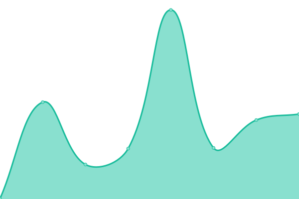
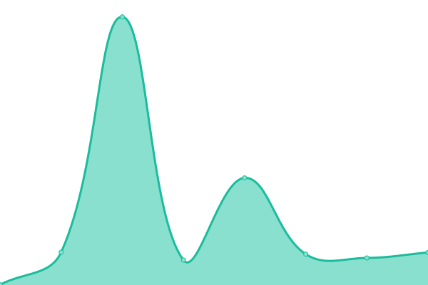

# [📈 Live Status](https://status.krea.edu.in): <!--live status--> **🟩 All systems operational**

This repository contains the open-source uptime monitor and status page for [Senthil Prabhu K](https://status.krea.edu.in), powered by [Upptime](https://github.com/upptime/upptime).

With [Upptime](https://upptime.js.org), you can get your own unlimited and free uptime monitor and status page, powered entirely by a GitHub repository. We use [Issues](https://github.com/senthilkrea/ping/issues) as incident reports, [Actions](https://github.com/senthilkrea/ping/actions) as uptime monitors, and [Pages](https://status.krea.edu.in) for the status page.

<!--start: status pages-->
<!-- This summary is generated by Upptime (https://github.com/upptime/upptime) -->
<!-- Do not edit this manually, your changes will be overwritten -->
<!-- prettier-ignore -->
| URL | Status | History | Response Time | Uptime |
| --- | ------ | ------- | ------------- | ------ |
|  [Krea Main Site](https://krea.edu.in) | 🟩 Up | [krea-main-site.yml](https://github.com/senthilkrea/ping/commits/HEAD/history/krea-main-site.yml) | 

 1525ms
     
 | 

<a href="https://status.krea.edu.in/history/krea-main-site">99.60%</a>
    

|  [Krea Erp](https://erp-testing.krea.edu.in) | 🟩 Up | [krea-erp.yml](https://github.com/senthilkrea/ping/commits/HEAD/history/krea-erp.yml) | 

 1155ms
     
 | 

<a href="https://status.krea.edu.in/history/krea-erp">99.46%</a>
    

|  [Krea Cdn](https://cdn.krea.edu.in) | 🟩 Up | [krea-cdn.yml](https://github.com/senthilkrea/ping/commits/HEAD/history/krea-cdn.yml) | 

 3169ms
     
 | 

<a href="https://status.krea.edu.in/history/krea-cdn">99.85%</a>
    

|  [Krea Sis](https://sis.krea.edu.in) | 🟩 Up | [krea-sis.yml](https://github.com/senthilkrea/ping/commits/HEAD/history/krea-sis.yml) | 

 1100ms
     
 | 

<a href="https://status.krea.edu.in/history/krea-sis">99.48%</a>
    

|  [Krea Budget](http://budget.krea.edu.in) | 🟩 Up | [krea-budget.yml](https://github.com/senthilkrea/ping/commits/HEAD/history/krea-budget.yml) | 

 2261ms
     
 | 

<a href="https://status.krea.edu.in/history/krea-budget">99.65%</a>
    

<!--end: status pages-->

[**Visit our status website →**](https://status.krea.edu.in)

## 📄 License

- Powered by: [Upptime](https://github.com/upptime/upptime)
- Code: [MIT](./LICENSE) © [Senthil Prabhu K](https://status.krea.edu.in)
- Data in the `./history` directory: [Open Database License](https://opendatacommons.org/licenses/odbl/1-0/)
